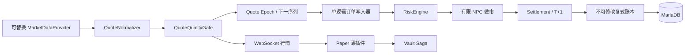

# AStock Exchange

一个面向 Paper 26.2 多子服网络的“A 股镜像模拟交易所”。现实行情只作为价格锚点；玩家交易的是服务器内部虚拟股份，所有资金、持仓、订单、盈亏和审计记录都在 AStockService 与 MariaDB 中结算，不连接真实证券账户。

本仓库交付的是可运行首版，不是概念脚手架：

- `astock-domain`：固定点金额、统一行情、质量闸门、有效期交易规则和交易时段模型；
- `astock-service`：Spring Boot 4.1 / Java 25 独立服务，包含 REST、WebSocket、Flyway、单逻辑写入队列、下一行情序列成交、部分成交、T+1、Broker Wallet、有限 NPC 做市、复式账本、风控与管理审计；
- `astock-paper`：Paper 26.2 薄插件，包含异步服务客户端、行情推送缓存、全局 GUI 刷新器、玩家/管理命令、反射式 Vault 桥接和本地持久化转账 Saga 日志；
- `compose.yaml`：MariaDB 11.8.8 与 AStockService 的本地部署；
- 自动化测试：覆盖固定点运算、行情拒绝条件、交易时段、订单幂等、下一序列成交、T+1、买卖闭环、撤单释放、转账和账本零和校验。

## 关键安全语义



- 市价单记录接单行情序列，只能在更大的有效序列上成交；
- 缺买一/卖一、行情超过 5 秒、停牌、质量冲突或数据源失败时不成交；
- 限价买单冻结最大现金与费用，限价卖单冻结股份，撤单原子释放；
- 买入 lot 到下一交易日才进入可卖数量；
- 每笔资金和股份账本按 `transaction_id + currency` 汇总必须为零；
- Paper 主线程不进行 HTTP、WebSocket、数据库、JSON 批处理或撮合；
- AStockService 不可用时插件行情会标为断线，交易请求失败关闭；最后行情不会被伪装成可成交行情。

## 版本

- Java 25
- Gradle 9.6.1（Wrapper 含官方 SHA-256 校验）
- Spring Boot 4.1.0
- Paper API `26.2.build.111-stable`（固定 build，不动态拉取）
- MariaDB 11.8.8

## 快速验收

Windows：

```powershell
.\gradlew.bat clean test build
```

Linux/macOS：

```bash
./gradlew clean test build
```

产物：

- `astock-service/build/libs/astock-service.jar`
- `astock-paper/build/libs/AStockPaper-1.0.0.jar`

## 本地服务启动

1. 复制 `.env.example` 为 `.env`，为三个密码项生成不同的高强度随机值。
2. 启动服务：

```bash
docker compose up -d --build
docker compose ps
```

3. 健康检查：

```bash
curl http://127.0.0.1:8787/actuator/health
```

默认行情源是确定性的 `mock`，适合全天候功能测试。生产配置默认执行真实交易时段；如需在非交易时间验收，可临时在 `.env` 设置 `ASTOCK_ENFORCE_SESSIONS=false`，但不要把它带入正式服。

不使用 Docker 时，可先启动 MariaDB，再设置 `ASTOCK_DB_URL`、`ASTOCK_DB_USER`、`ASTOCK_DB_PASSWORD`、`ASTOCK_API_KEY`，然后运行：

```powershell
java -jar astock-service\build\libs\astock-service.jar
```

## Paper 安装

1. 安装 Paper 26.2、Vault 及一个 Vault 兼容经济插件。
2. 将 `AStockPaper-1.0.0.jar` 放入每个 Paper 子服的 `plugins/`。
3. 首次启动后编辑 `plugins/AStockPaper/config.yml`：
   - `service.base-url` 指向共享的 AStockService；
   - `service.api-key` 必须与 `ASTOCK_API_KEY` 完全一致；
   - 每个子服设置唯一 `paper.server-id`。
4. 重启 Paper。Velocity 不安装交易核心，也不处理订单。

插件在 `plugins/AStockPaper/transfer-journal.json` 持久化 Vault 跨系统 Saga。不要手工删除仍有记录的文件；若服务器恰好在经济 API 调用边界崩溃，插件会提示管理员运行对账。

## 玩家命令

```text
/stock market
/stock quote <代码>
/stock balance
/stock positions
/stock orders
/stock buy <代码> <股数> [限价元]
/stock sell <代码> <股数> [限价元]
/stock cancel <订单ID>
/stock deposit <游戏币>
/stock withdraw <游戏币>
/stock disclaimer
```

管理命令：

```text
/stock admin status
/stock admin source
/stock admin freeze <代码> [原因]
/stock admin unfreeze <代码>
/stock admin reconcile <玩家名或 UUID>
/stock admin audit <订单ID>
/stock admin treasury
```

## 行情模式

`mock` 是默认开发源。`eastmoney` 适配器可通过 `ASTOCK_DATA_PRIMARY=eastmoney` 显式开启，并会执行一次全市场请求后只保留数据库白名单，订单触发时再请求目标股票盘口。相同股票两秒内的细节请求使用 single-flight 合并；概览行情只触发盘口确认，绝不直接伪造成交。

东方财富适配器仅定位为开发、内测、小规模非商业环境，没有 SLA。本项目不授予任何行情展示或再分发权。正式公开或商业运营必须实现 `MarketDataProvider` 接入有明确游戏内展示授权的数据商，并在切换前完成法务/合规评估。不要将 `mock` 配成真实源的故障备用，否则会把合成价格引入交易。

开发数据库预置 20 只沪深高流动性股票用于确定性验收。正式白名单应通过 `astock_security` 与带生效日期的 `astock_security_rule` 扩展到运营方审核过的 200～300 只；ST、新股、退市整理、停牌、北交所和无法识别风险状态的品种应保持关闭。

## 金额单位

- 行情价格：`long`，1 单位 = `0.0001 CNY`；
- Broker Wallet：`long`，1 单位 = `0.01 游戏币`；
- 股份：`long`，单位为股；
- 所有乘法通过受检固定点函数完成，统一使用四舍五入，不使用 `double` 结算。

REST 详情见 [docs/API.md](docs/API.md)，部署、备份、故障处置和对账见 [docs/OPERATIONS.md](docs/OPERATIONS.md)。

## 玩家必须知悉

> 本系统为 Minecraft 服务器内的虚拟模拟交易玩法。所有交易仅使用服务器游戏币，不代表真实证券所有权，不构成证券交易或投资建议。行情可能存在延迟、错误或中断，游戏币及虚拟持仓不得兑换为现金或其他现实财产。

如果游戏币可以使用人民币购买，不应让付费取得的游戏币直接进入本玩法；上线前还需要独立运营与合规评估。不可提现只能降低风险，不能解决行情数据授权问题。
